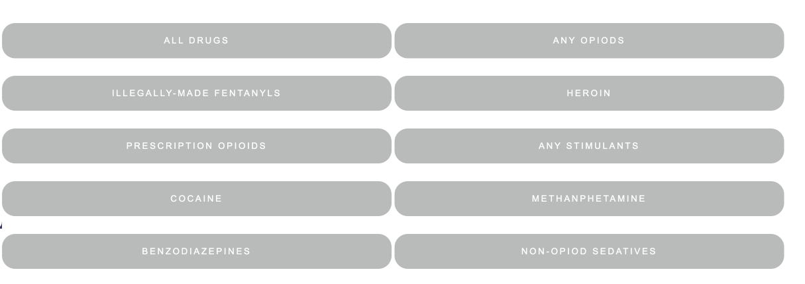
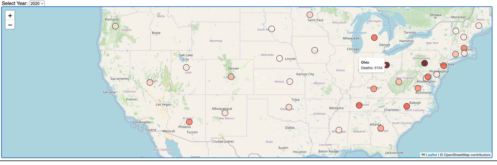

# Project_3 Overdose deaths 2020-2022 analysis *
This repository contains all fo the files related to the Project 3
 
For this project we wanted to find out if there been a consistent increase on the number of deaths related to overdose throughout all of America in the last few years? If so, what drugs are causing it? 
What state has the highest rate of overdose deaths?

Our project contains data from 30 out of the 50 states in America (states can vary from year to year).
In 2022 there was a total of 51,435 deaths related to overdose in America

The site is hosted in GitHub pages and can be found on the following website: 
The website has different functions such as buttons with dropdowns that filter the data by year (2020, 2021, 2022) and clickable buttons.
In the first part of the website you will be welcomed by the  Title, subtitle and under you will se a button that once it's clicked it will display a dropdown menu.
Your will be given the option to select a year out of the following: 2020, 2021 or 2022.
Selecting a year will cause a change in the visualization seen.
After selecting a year you will be given the option to select one of the following buttons:

In doing so the bar charts shown will change depending on the selected drug.
Remember you can filter by both drug and year.

Under the graph you will be able to see another buttong with a dropdown menu, this menu controls the data displayed on the map.
After selecting a year you can continue to interact with the map, if you hover the cursor over one of the circles a marker will appear displaying the number of deaths per state. Also note that the colors of the circles vary from state to state and year to year. The darker the circle, the more deaths the state had.

Under the map you will find a button with a dropdown menu, this button controls the last 4 charts of the website, that means that selecting a year will cause a change in the las 4 visualizations. (Overdose deaths by race/ ethnicity, by age, by sex and by drug clases).

For this project we made sure to that the data presented did not include names or personal information of any kind related to the numerous deaths, we also made sure to use data that was available for all of the public, in doing so avoiding any king for illegal or unethical use for the dataset. 

The data set used was gathered from the CDC’s (Center for Disease Control and Prevention) State Unintentional Drug Overdose Reporting System
Original data can be found in a XLSX file in the following website: https://www.cdc.gov/drugoverdose/fatal/dashboard/index.html#!

In order to fullfill the requirements regarding the use of a library not seen in class we used the anime.js library.
The code to use this library can be found on the following git repository: https://github.com/juliangarnier/anime?tab=readme-ov-file
The code used from the respository is the following:
 anime({
    targets: 'body div h1',
    translateX: 500,
    rotate: '1turn',
    backgroundColor: 'rgba(155, 15, 236, 0)',
    duration: 2500
  });

